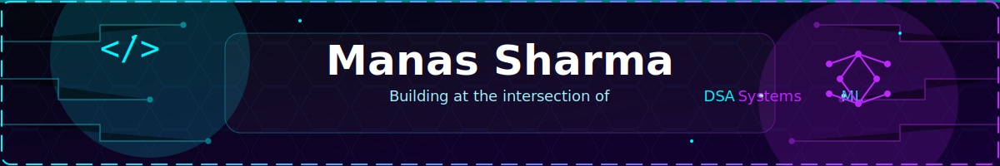

<!-- Banner: self-hosted SVG (assets/banner.svg), no external service = never breaks.
     Edit text/colors directly in the SVG file. -->

  <!-- REPLACE with the raw URL once you've committed assets/banner.svg to your repo -->
  

<!-- Animated typing line — edit text at https://readme-typing-svg.demolab.com -->

  

  <!-- REPLACE username in every badge below with your GitHub username -->
  
  
  
  

---

### 👋 About Me

I'm a Computer Science undergrad who enjoys taking things apart to see how they work — mostly through **Data Structures & Algorithms**, open-source code, and the occasional 2 a.m. debugging session. Currently rounding out my skill set with full-stack development and a growing interest in **System Design** and **Machine Learning**.

- 🎓 B.Tech CSE, BML Munjal University (Class of 2029)
- 🧠 Strong foundation in C++ & DSA — 300+ problems solved on LeetCode
- 🌱 Open-source contributor, ranked **AIR 114 / 5000+** at Elite Coders Winter of Code
- 🛠️ Learning full-stack development and exploring applied ML
- 📫 Reach me at **manasmailsss@gmail.com**

---

### 🧩 Open Source Journey

| Program | Highlight |
|---|---|
| **Elite Coders Winter of Code 2026** | AIR **114 / 5000+** participants |
| **GirlScript Summer of Code 2026** | Selected Contributor |
| Pull Requests Merged | **40+** across community repositories |

I contribute primarily to repos touching DSA tooling, web utilities, and beginner-friendly issues — with the goal of taking on progressively larger PRs.

---

### 🏆 Achievements

- 🥇 **AIR 114** of 5000+ participants — Elite Coders Winter of Code (ECWoC 2026)
- 🔀 **40+ pull requests** merged in open source
- 🌸 Selected contributor — **GirlScript Summer of Code 2026**
- 🧮 **300+ problems solved** on LeetCode (C++) — arrays, trees, graphs, DP

---

### 💻 Tech Stack

**Languages**

**Frontend**

**Tools & Platforms**

---

### 🚀 Featured Projects

<table>
  <tr>
    <td width="60"></td>
    <td>
      <b>Neural Network for MNIST Digit Classification</b> 
      Trained a neural network to classify handwritten digits, reaching <b>97.45% test accuracy</b>. 
      <code>Python</code> <code>TensorFlow</code> <code>Keras</code> <code>NumPy</code> 
      <!-- REPLACE with your project link -->
      <a href="#">🔗 View Repository</a>
    </td>
  </tr>
  <tr>
    <td width="60"></td>
    <td>
      <b>Local RAG Application</b> 
      A locally-hosted Retrieval-Augmented Generation app for document Q&A, running fully offline. 
      <code>LangChain</code> <code>Streamlit</code> <code>Ollama</code> <code>ChromaDB</code> 
      <!-- REPLACE with your project link -->
      <a href="#">🔗 View Repository</a>
    </td>
  </tr>
</table>

---

### 📚 Currently Learning

`System Design`  ·  `Advanced Machine Learning`  ·  `React & Backend APIs`  ·  `LLM Tooling`

---

### 📊 GitHub Stats

<!-- These three images are generated by .github/workflows/profile-summary-cards.yml
     and pushed to the "output" branch — no live Vercel dependency, so they can't 503 on you. -->

  
  

  

<!-- Trophies: still served live from the public instance. This one has generally stayed
     reliable, but if it ever breaks, self-host via github.com/ryo-ma/github-profile-trophy -->

  

<!-- Contribution snake — generated by .github/workflows/snake.yml, pushed to the "output" branch -->

  <picture>
    <source media="(prefers-color-scheme: dark)" srcset="https://raw.githubusercontent.com/ManasCodez/ManasCodez/output/github-contribution-grid-snake-dark.svg" />
    <source media="(prefers-color-scheme: light)" srcset="https://raw.githubusercontent.com/ManasCodez/ManasCodez/output/github-contribution-grid-snake.svg" />
    
  </picture>

---

### 🤝 Let's Connect

  
  
  

  <i>"Just Give Up, but Tomorrow"</i>

<!--
============================================================
SETUP CHECKLIST — do this once after pushing to ManasCodez/ManasCodez
============================================================
1. Commit assets/banner.svg (included alongside this README) to the repo root.
   Update the  at the top of this file if your repo/branch differs.

2. Copy .github/workflows/profile-summary-cards.yml and
   .github/workflows/snake.yml into your repo's .github/workflows/ folder.

3. Go to Settings → Actions → General → Workflow permissions, and set it to
   "Read and write permissions". Both workflows need this to push generated
   files to the "output" branch.

4. Go to the Actions tab and manually run each workflow once
   (workflow_dispatch) so the "output" branch and its files get created
   immediately, instead of waiting for the daily schedule.

5. After the first run, check the "output" branch to confirm the SVG paths
   match what this README references — the stats-card action's exact output
   filenames can shift between versions, so verify before relying on them.
============================================================
-->
